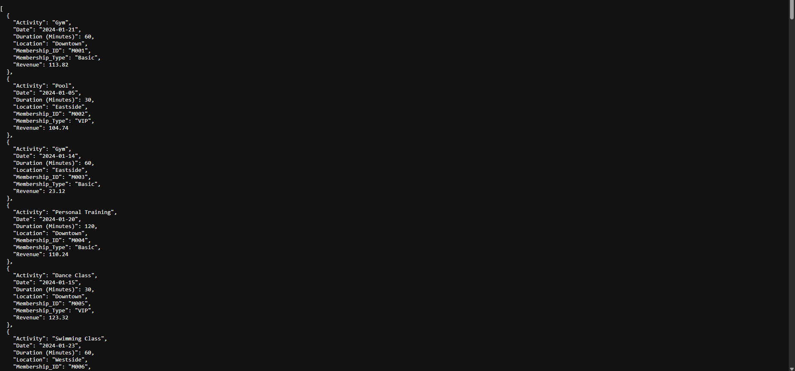
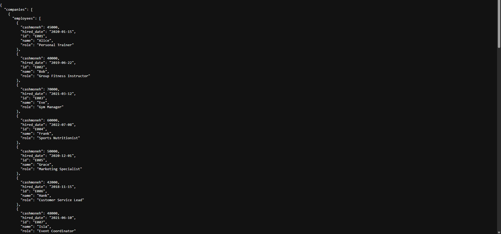
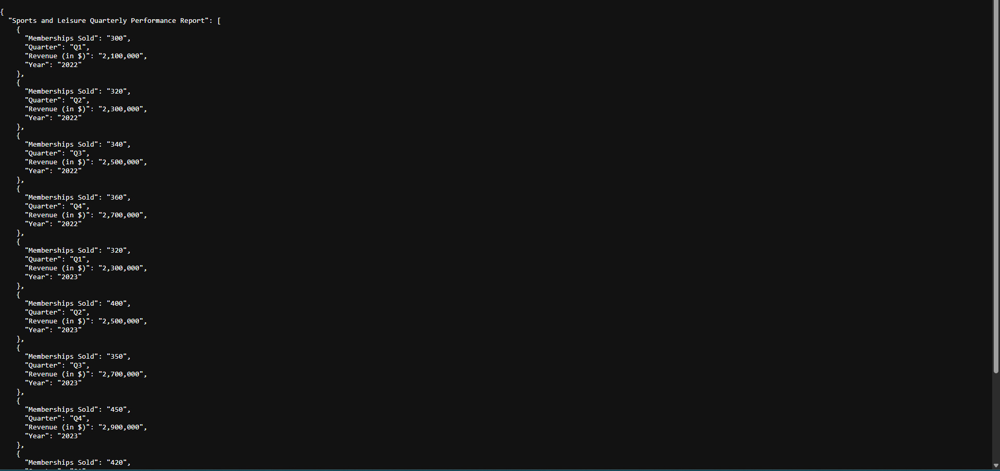
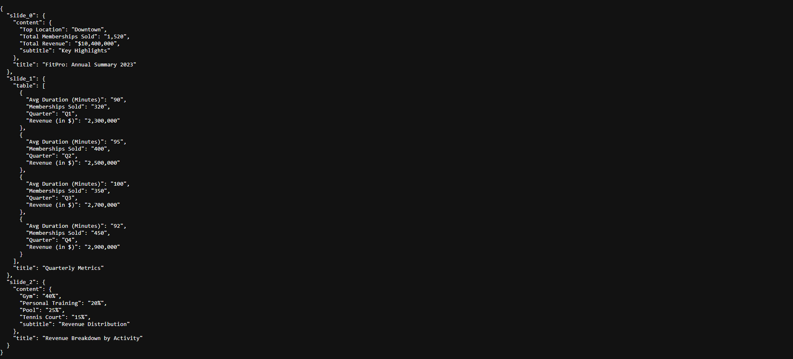
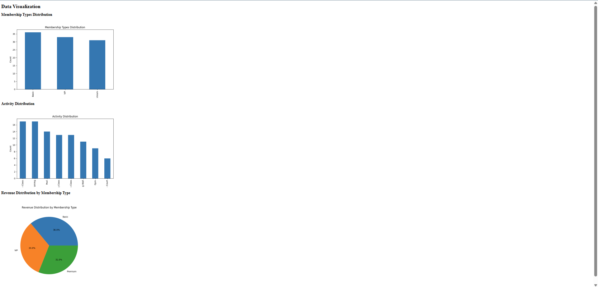

# Topo AI Assignment
Keshav Nath, 4th Jan 2025

## Overview

This Flask app is designed to read, process, and visualize data from CSV, PPTX, JSON, and PDF files provided. The app offers the required APIs for accessing unified data, specific file-type data and visualizations.

## File Structure

### `app.py`
This is the main Flask application file, where routes are defined to interact with the app. It includes:
- `/api/data` – Get all unified data.
- `/api/data/<file_type>` – Get data of a specific file type (CSV, JSON, PDF, PPTX).
- `/visualization` – Renders visualizations based on CSV data.

### `AppFunctions.py`
This file contains the `DataIngestion` class, which handles reading different file types, as well as unification.

The `DataProcessor` class is responsible for organizing the data and returning it unified.

### `AppVisualization.py`
This file provides the `VisualizatoinHandler` class, which contains methods to generate 3 visualizations (2 bar and 1 pie chart)

### `datasets/`
This folder contains the given sample datasets for testing:
- `dataset1.json`
- `dataset2.csv`
- `dataset3.pdf`
- `dataset4.pptx`

### `requirements.txt`
All the packages needed to run this API

## Available Endpoints

### 1. Get All Unified Data
- **URL**: `/api/data`
- **Method**: `GET`
- **Description**: Returns all data in a unified JSON format.
- [Sample json](./samples/unified_data.json) can be found in the `samples` folder

### 2. Get Data by File Type
- **URL**: `/api/data/<file_type>`
- **Method**: `GET`
- **Description**: Retrieves data from a specific file type. Supported file types: `csv`, `pptx`, `json`, `pdf`.
- Samples below
  - CSV 
  - JSON 
  - PDF 
  - PPTX 

### 3. Visualization Page
- **URL**: `/visualization`
- **Method**: `GET`
- **Description**: Displays bar and pie charts based on the CSV data, showing membership type distribution, activity distribution, and revenue distribution.
- Sample below
- Graphs 